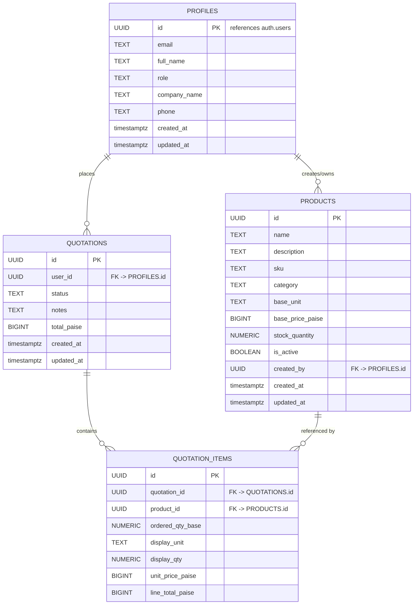

# SAMEDCHEM — Database Schema Diagram

This document contains an entity-relationship diagram (ERD) for the SAMEDCHEM application and short notes about each table, important columns, and relationships.



## Notes and rationale

- `profiles` stores application profile information and links to `auth.users` (Supabase auth). `role` is constrained to `admin | seller | buyer`.
- `products` uses `base_unit` (`g`, `mL`, `unit`) and stores `base_price_paise` as an integer (paise) to avoid floating point rounding for money.
- `stock_quantity` uses `NUMERIC(20,6)` so the system can record very large quantities and fractional quantities with high precision.
- `quotations` is the order/quotation header and stores `total_paise` as `BIGINT` (sum of item paise values).
- `quotation_items` stores the quantity in base units (`ordered_qty_base`) and also keeps a copy of the `unit_price_paise` and `line_total_paise` for auditing and immutability.

## Important design decisions

- Money/price storage: store prices in paise (integer) to avoid floating point issues; format for display using locale formatting (Intl.NumberFormat) on the application layer.
- Units & conversion: the app keeps conversion factors in code (`src/lib/units.ts`) and converts display qty → base qty when creating `quotation_items`.
- Row Level Security (RLS): the schema includes RLS policies so users can only view their own profiles and quotations; admins are allowed broader access. Keep server-side enforcement for critical operations.

## Common queries

- Get all quotations that include products created by a particular seller (seller sees related quotations):

```sql
SELECT q.*
FROM public.quotations q
JOIN public.quotation_items qi ON qi.quotation_id = q.id
JOIN public.products p ON p.id = qi.product_id
WHERE p.created_by = '<seller-uuid>'
GROUP BY q.id
ORDER BY q.created_at DESC;
```

- Calculate a line total (done in app prior to insert) but you can verify with SQL:

```sql
-- given unit_price_paise and ordered_qty_base
SELECT (unit_price_paise * ordered_qty_base)::BIGINT AS expected_line_total_paise
FROM public.quotation_items
WHERE id = '<quotation-item-uuid>';
```

## Next steps / suggestions

- Optionally add a `units` table if conversion factors must be editable by admins; currently conversions are canonical and stored in application code.
- Add an index on `products.created_by` and on `quotation_items.product_id` to speed seller-related queries.
- Consider a `seller_id` column on `quotations` if you want to map an entire quotation to a single seller (useful when orders are seller-specific); currently seller visibility is derived from `quotation_items -> products`.

---

If you want, I can also:

- generate an SVG image of this ERD and commit it to `docs/`, or
- add an additional diagram that includes RLS rules and common indexes.

Which would you prefer? (answer: `svg`, `rules`, or `both`)
